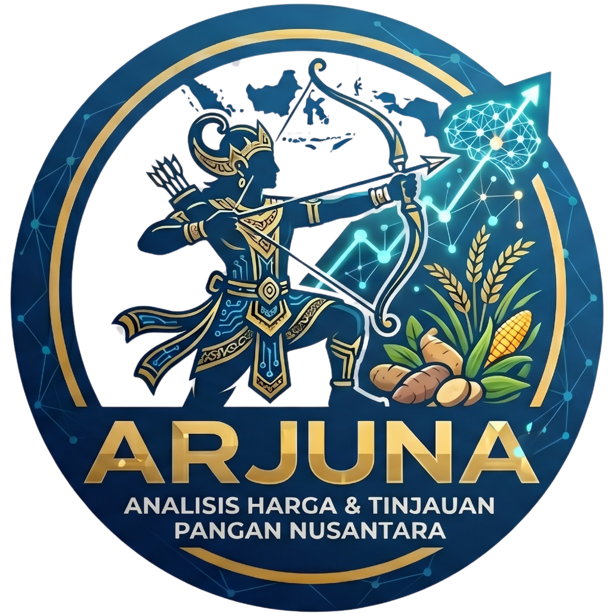

  

---

  

# 🏹 ARJUNA (Analisis Harga & Tinjauan Pangan Nusantara)

  
  

ARJUNA adalah platform **Business Intelligence berbasis AI** yang dirancang untuk memperluas akses masyarakat terhadap informasi harga pangan di Indonesia. Platform ini menerjemahkan data teknis yang rumit dari **Pusat Informasi Harga Pangan Strategis (PIHPS)** menjadi visualisasi dashboard yang intuitif, membantu masyarakat umum, konsumen rumah tangga, dan pelaku usaha kecil (UMKM F&B) memantau serta memprediksi fluktuasi harga komoditas pangan secara akurat.

---

## 📌 Ringkasan Proyek

### 1. Latar Belakang & Alasan Pemilihan Proyek
Volatilitas harga pangan sering kali menjadi beban ekonomi harian bagi masyarakat Indonesia, khususnya konsumen rumah tangga dan pelaku usaha kecil. Selama ini, informasi harga pangan dan alat analisis pendukungnya masih belum disajikan dalam bentuk yang mudah dipahami publik. ARJUNA hadir sebagai **"navigasi inflasi harian"** yang menerjemahkan data teknis menjadi informasi visual sederhana agar masyarakat dapat merencanakan belanja dan pengadaan bahan baku dengan lebih presisi.

### 2. Rumusan Masalah (Problem Statement)
Tingginya volatilitas harga pangan dan terbatasnya akses terhadap informasi pasar yang mudah dipahami membuat masyarakat kesulitan mengantisipasi fluktuasi harga secara mendadak. Belum adanya platform yang menyediakan data prediktif sederhana menyebabkan konsumen sering kali membeli bahan pokok pada harga puncak, yang dapat menurunkan daya beli masyarakat secara keseluruhan.

### 3. Pertanyaan Penelitian (Research Questions)
*   Bagaimana merancang dashboard berbasis data PIHPS yang intuitif, *mobile-first*, dan mudah dipahami oleh masyarakat dengan tingkat literasi data yang beragam?
*   Seberapa akurat model *Machine Learning* dalam memprediksi tren kenaikan atau penurunan harga komoditas pangan jangka pendek?
*   Sejauh mana prediksi harga yang transparan dapat membantu masyarakat merencanakan belanja dan membantu usaha kecil mengelola pengadaan bahan baku secara lebih efisien?

---

## 🚀 Fitur & Cakupan Proyek

### ✅ In-Scope (Cakupan Proyek)
*   **Aplikasi Lintas Platform:** Tersedia dalam versi Web dan Mobile sebagai pemandu harga pangan harian.
*   **Ekstraksi Otomatis:** Pipeline ETL yang secara berkala menarik data dari PIHPS Nasional.
*   **Prediksi AI/ML:** Pemrosesan forecasting harga menggunakan kecerdasan buatan berbasis cloud.
*   **Visualisasi UI/UX Sederhana:** Representasi visual dengan indikator yang mudah dimengerti (Naik / Turun / Stabil).

### ❌ Out-of-Scope (Di Luar Cakupan)
*   Transaksi e-commerce jual beli sembako.
*   Layanan pesan-antar bahan pangan.
*   Sistem pelaporan dan distribusi subsidi pemerintah.

---

## 🛠️ Arsitektur & Teknologi

ARJUNA dibangun menggunakan pendekatan arsitektur **microservices** yang scalable dan andal:

*   **Bahasa Pemrograman:** Python 3.12+ (Backend, Scraping, & ML)
*   **Framework Backend & AI:**
    *   **FastAPI:** Framework web berkinerja tinggi untuk API gateway.
    *   **Meta Prophet:** Framework khusus *time-series forecasting* untuk memprediksi harga dengan pola musiman.
    *   **XGBoost:** Model gradient boosting untuk menangkap hubungan non-linear.
    *   **Pandas & NumPy:** Library analisis data dan komputasi numerik.
*   **Integrasi AI Generatif:**
    *   **OpenAI API & Google Gemini API:** Untuk menyusun narasi analisis pasar secara otomatis menjadi wawasan yang mudah dicerna.
*   **Infrastruktur & Cloud:**
    *   **GCP/AWS/Virtual Private Server (VPS):** Untuk deployment 24/7.
    *   **Docker & Kubernetes:** Containerization untuk skalabilitas dan portabilitas.
    *   **CI/CD Pipeline:** Jalur integrasi dan pengantaran otomatis.
    *   **PostgreSQL / MySQL:** Database relasional penyimpan riwayat harga pangan.
*   **Antarmuka Pengguna (Frontend & Mobile):**
    *   **Web Dashboard:** Dashboard Business Intelligence responsif dengan pendekatan *mobile-first*.
    *   **Mobile App:** Aplikasi seluler (Android & iOS) berbasis *cross-platform* (Flutter / React Native).

---

## 🗓️ Jadwal Pelaksanaan & Milestone

Proyek ini dilaksanakan selama 5 minggu (11 Mei – 14 Juni 2026):

*   **Minggu 1: Arsitektur Sistem, Desain, & Persiapan Data (11 – 17 Mei 2026)**
    *   *Milestone 1:* Infrastruktur dasar siap, desain UI/UX disetujui, dan data historis terkumpul.
*   **Minggu 2: Pengembangan API & Model Prediktif AI (18 – 24 Mei 2026)**
    *   *Milestone 2:* API prediksi AI aktif dan mulai mengirimkan output data JSON secara lokal.
*   **Minggu 3: Pengembangan Antarmuka Web & Mobile (25 – 31 Mei 2026)**
    *   *Milestone 3:* Prototipe interaktif Web dan Mobile terhubung dengan data riil dari Backend.
*   **Minggu 4: Integrasi Penuh & Internal System Testing (1 – 7 Juni 2026)**
    *   *Milestone 4:* Aplikasi ARJUNA versi Beta berfungsi penuh tanpa *critical error*.
*   **Minggu 5: UAT, Optimasi Server, & Rilis Final (8 – 14 Juni 2026)**
    *   *Milestone 5:* Proyek selesai, ARJUNA versi stabil live di Web Server dan Mobile Store.

---

## 👥 Tim Capstone (PJK-GU106)

Kolaborasi tim pengembang dalam program Pijak x IBM SkillsBuild:

| No | Nama | Cohort ID | Peran / Learning Path | Email |
| :---: | :--- | :---: | :--- | :--- |
| 1 | **Wilda Ariffatul Faisalnur** | APQ000D6Y0561 | Cloud Engineer & DevOps (Cloud Computing) | APQ000D6Y0561@student.devacademy.id |
| 2 | **Mochammad Rafly Herdianto** | APQ000D6Y0567 | Backend & AI Integration Developer (Back-End Development) | APQ000D6Y0567@student.devacademy.id |
| 3 | **Baso Rizky Hamdana** | APQ000D6Y0574 | Mobile Application Developer (Mobile Development) | APQ000D6Y0574@student.devacademy.id |
| 4 | **Neor Wildan** | APQ000D6Y0633 | Web Developer & UI/UX Designer (Front-End Development) | APQ000D6Y0633@student.devacademy.id |

### 📋 Uraian Peran & Tanggung Jawab

*   **Wilda Ariffatul Faisalnur**
    *   Merancang dan mengelola infrastruktur server di Google Cloud Platform (GCP).
    *   Mengatur containerization menggunakan Docker/Kubernetes dan jalur CI/CD agar pembaruan kode terunggah otomatis dan aman.
*   **Mochammad Rafly Herdianto**
    *   Membangun logika bisnis server dan database PostgreSQL/MySQL penyimpan riwayat harga.
    *   Membuat pipeline ETL otomatis dari PIHPS dan membungkus model prediksi AI ke dalam RESTful API.
*   **Baso Rizky Hamdana**
    *   Membangun aplikasi client-side Android & iOS dengan framework cross-platform.
    *   Mengembangkan notifikasi lonjakan harga real-time dan integrasi lokasi pasar terdekat.
*   **Neor Wildan**
    *   Mengembangkan dashboard web responsif mobile-first.
    *   Menampilkan grafik tren interaktif dan peta persebaran harga pangan untuk kemudahan literasi pengguna.
